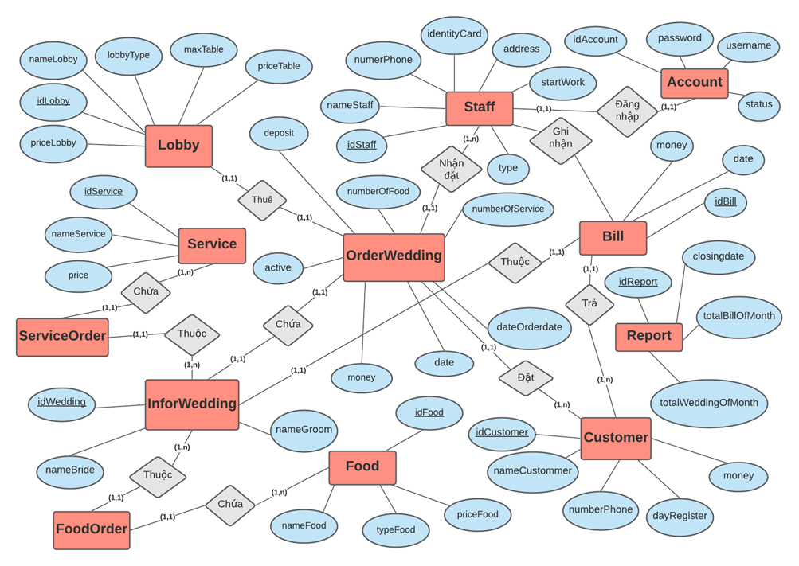
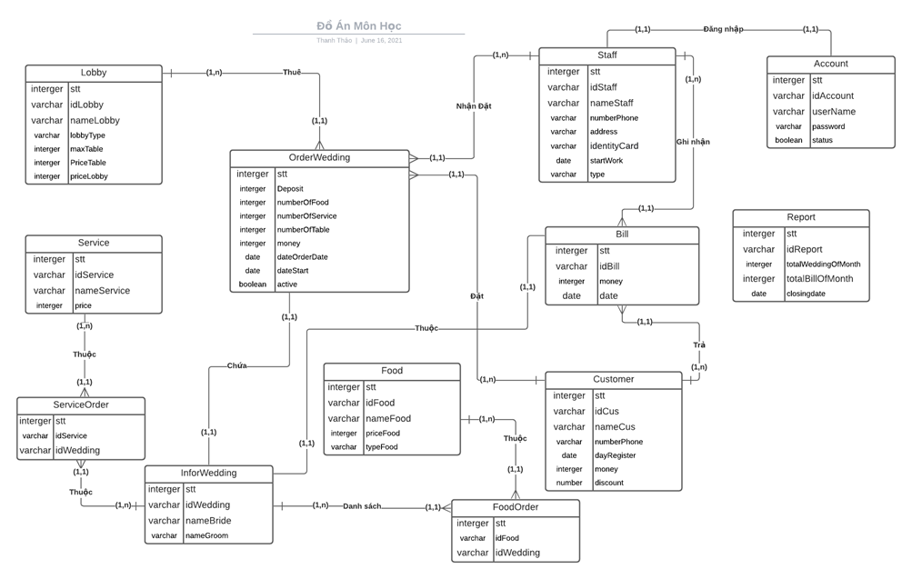

# Lập trình JAVA

#### Tên phần mềm: Quản lý nhà hàng tiệc cưới

#### Nền tảng: Window

#### Ngôn ngữ: Java

#### Cơ sở dữ liệu: [Oracle 19c](https://www.oracle.com/database/technologies/oracle-database-software-downloads.html#19c)

#### Thư viện tích hợp: JavaFX - [JDK 8](https://www.oracle.com/java/technologies/javase/javase-jdk8-downloads.html)

#### Môi trường phát triển: [Eclipse IDE](https://www.eclipse.org/downloads/) for Enterprise Java and Web Developers

#### Phần mềm thiết kế giao diện: [SceneBuilder](https://gluonhq.com/products/scene-builder/) - FXML

#### Link file cài : https://drive.google.com/drive/folders/1X2u96mbOzTOAyyF8MZ32TetVPgr27Pe-

1. Mô hình thực thể mối kết hợp ( ERD )

2. Mô hình dữ liệu quan hệ

